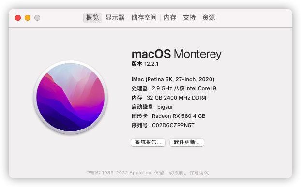

# MSI-MAG-B560M-MORTAR-i7-10700

基于[国光大佬的EFI](https://github.com/sqlsec/MSI-MAG-B560M-MORTAR-i7-10700)更新了一下OpenCore和驱动，详细说明请前往[原仓库](https://github.com/sqlsec/MSI-MAG-B560M-MORTAR-i7-10700)。

## 配置 Info

以下为我自己的配置（均为写文章时的最新版）：

macOS Monterey 12.2.1 + OpenCore 0.7.8

| 组件 | 名称                                            |
| ---- | ----------------------------------------------- |
| CPU  | i7 10700                                        |
| 主板 | 微星 B560M 迫击炮 （MSI MAG-B560M-MORTAR-WIFI） |
| 显卡 | 蓝宝石 RX560 4GB 超白金版 + intel UHD 630       |
| 网卡 | BCM94360CD 4 天线版本                           |
| 机型 | iMac 20,1                                       |

 ## 更新 Update

